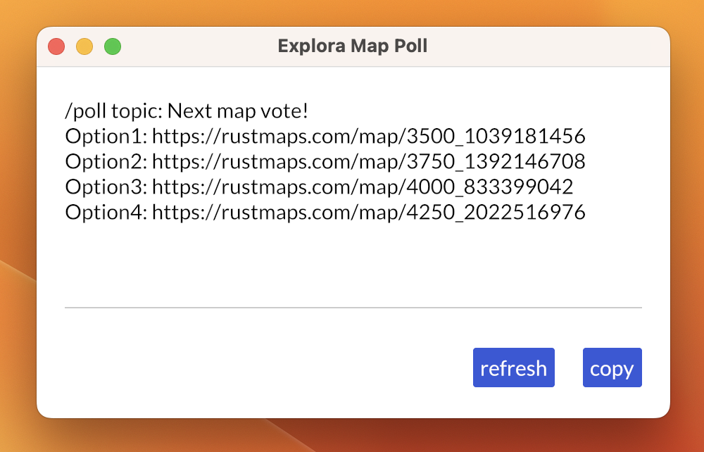

# Rust Map Poll Generator

Simple app that generates a random seed and created a link for rustmaps.com for use with Discord polls.



## Usage

_Assumes Rust (the programming language) is installed.( https://www.rust-lang.org/tools/install )_

```
> cargo run --release
```

## Packaging for standalone use

Bundling the application for standalone use can be done using `cargo-bundle`. This tool is used to generate installers or app bundles for GUI executables built with cargo. Install `cargo-bundle` using the following command: `cargo install cargo-bundle`.

Building the app for your platform, simply run:

```
> cargo bundle --release
```

The App can be found at `target/bundle/` and can be run from there.

## Windows environment

### Without visual studio
Install the Microsoft C++ Build Tools ( https://visualstudio.microsoft.com/visual-cpp-build-tools/ )

### With visual studio (advised by microsoft)

Install/select the following modules:
1. .NET desktop development
1. Desktop development with C++
1. Universal Windows Platform development

_More information can be found at: https://learn.microsoft.com/en-us/windows/dev-environment/rust/setup_
